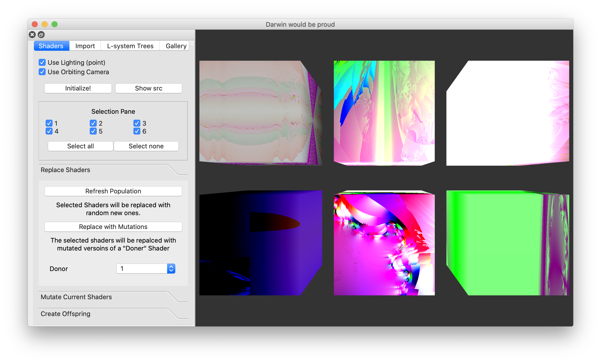

## Beagle

Beagle is a procedural shader generator that treats shaders as genotypes, allowing you to mutate shaders and create shader offspring!

## What it looks like

## Our Favourite Shaders

&nbsp;&nbsp;&nbsp;

&nbsp;&nbsp;&nbsp;
